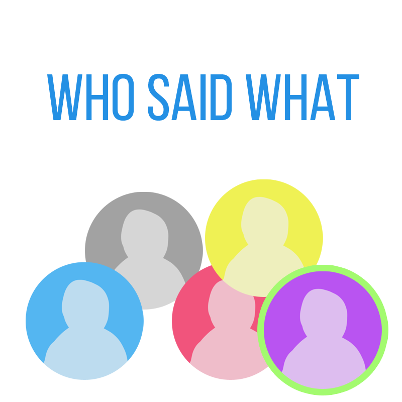

# Who Said What


`Who said What` is a server application [created at nwHacks 2019](https://devpost.com/software/who-said-what-xj9tuz) by
- [Jimmy Huang](https://jimmyhuang0904.github.io/)
- [Nicholas Wu](https://nickwu241.github.io)
- [Sorina Chirhei](https://github.com/schirhei)

**Problem**:
Remote confrence calls usually involves multiple people on one side using the same device,
and the other side can only detect when that device is speaking, not who is speaking nor what the speaker's role is.

**Solution**:
Our app distinguishes/recognizes speakers and automatically transcribe the meeting in real time.
When the meeting ends, our app can also export the meeting minutes (log of who said what at what time).

**Features**:
- display who is currently speaking using speaker recognition
- create and train a new speaker profile within 15 seconds
- stream transcription to services such as `Slack`
- export transcription to cloud storage such as `Google Sheets`

**Bonus security feature**:
- authenticate a speaker via voice and send a verification code only if the speaker is authorized

How does this work? For example:
1. A supervisor needs to enter a restricted room
2. They say "unlock the door"
3. Our app will verify the voice and check that they have sufficent permissoins
4. Finally, the supervisor's phone will recieve a SMS verification code that can be used to unlock the door

## Development
Running the app requires:
1. `sox` for recording voices and an aduio interface on the computer that can can sample at 16,000Hz
2. `node` and dependencies, install via `npm install`
3. All the secrets for the APIs we're using
   - `WHO_SAID_WHAT_KEY` for Microsoft services such as [Speaker Recognition](https://azure.microsoft.com/en-ca/services/cognitive-services/speaker-recognition/) and [Speech to Text](https://azure.microsoft.com/en-ca/services/cognitive-services/speech-to-text/)
   - Google Crendtial files (2 total) for [Google Cloud Speech to Text](https://cloud.google.com/speech-to-text/) and [Google Sheets API](https://developers.google.com/sheets/api/) respectively


To run the app:
```
node js.js
```

### Set Azure Subscription Key with Environment Variable
```
export WHO_SAID_WHAT_KEY={your_subscription_key}

old api profile ids
03f5cadf-309f-4228-8390-05007eb83ece = Jimmy
cd74bc8f-71c5-46cf-82d6-9f3f30dadc30 = Nick
5d545b81-a3d9-4ea7-be55-aba94c7c1a05 = Sorina
157e954b-6fe7-4d96-a9ac-f1135521e9fa = Nick-Mickey

new api key profile ids:
ef55fc9b-8460-4714-a238-688426f5d5b5 - Jimmy
1109557c-b12a-4f30-a7a7-642ee96b1c6c - Nick
15b130f8-afe2-405f-80e1-311db85cd29e - Sorina
0af25686-240b-4054-8821-305ef4a2502c - MickeyMouse
```

### Enrolling Speech to Profile
[Read phrases from here](https://didyouknowfacts.com/7-random-facts-something-say/).